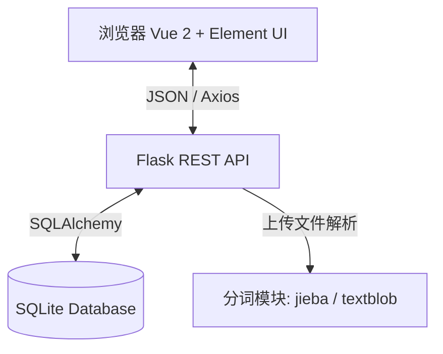
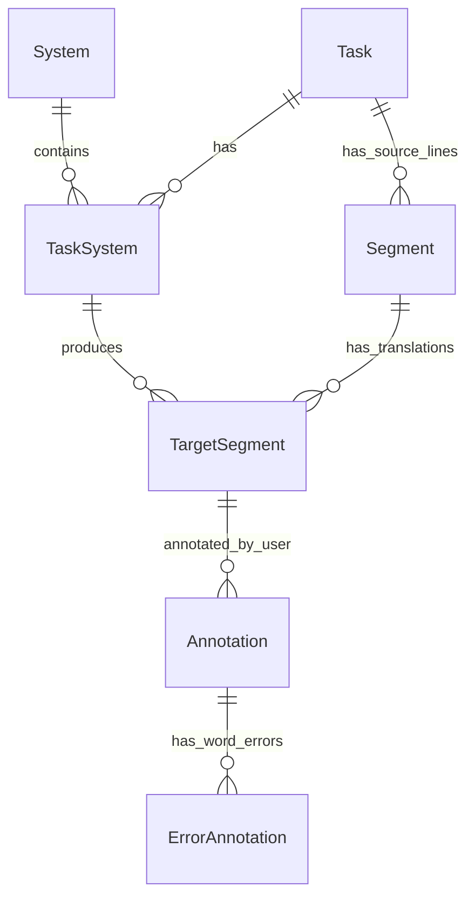

# DESIGN: 机器翻译人工评测系统 (Human Eval)

## 1. 系统整体架构

## 2. 核心数据模型设计 (ER图)

## 3. 接口契约规范
- `GET /api/config`: 返回当前用户信息和错误类型字典。
- `POST /api/tasks`: 接收 `multipart/form-data`（名称、语向、原文文件、译文文件数组），返回任务ID。
- `GET /api/evaluate/<task_id>?page=N`: 返回指定任务第N句的原文、各个译文的分词列表、以及当前用户的标注记录。
- `POST /api/annotation`: 接收JSON（task_id, target_segment_id, da_score, rr_rank, errors数组），保存标注。
- `GET /api/export/<task_id>`: 返回生成的 Excel 文件流。

## 4. 关键交互流 (划词标注)
1. 前端渲染译文Token数组，每个Token绑定 `data-idx`。
2. `mousedown/mouseup` 或 `click` 选中多个Token，标记为淡黄色。
3. `contextmenu` (右键) 触发弹窗，展示错误类型列表。
4. 选择错误类型后，前端合并连续的Token Index，推入 `target.annotation.errors` 数组，默认严重程度1。
5. 触发防抖保存 API。
