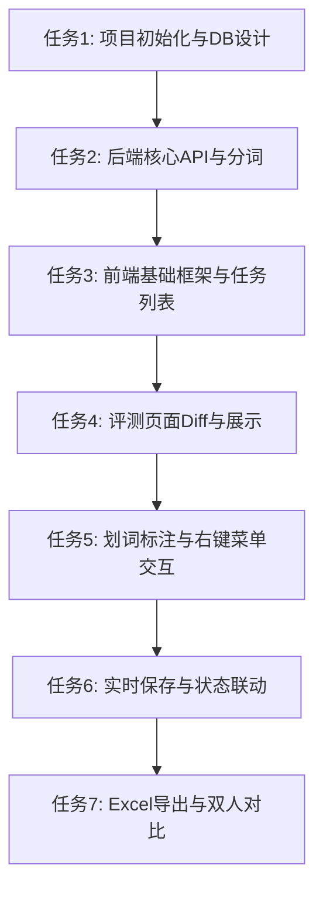

# TASK: 机器翻译人工评测系统 (Human Eval)

## 子任务拆分与依赖

### 原子任务详情
- **T1: 项目初始化与DB设计**
  - **输入**: SQLAlchemy配置
  - **输出**: `backend/models.py`, `backend/database.py`, `app.py`骨架
- **T2: 后端核心API与分词**
  - **输入**: txt文件
  - **输出**: `backend/utils.py` (jieba/textblob), `/api/tasks` 创建逻辑
- **T3: 前端基础框架与任务列表**
  - **输出**: `index.html`, `app.js` (Vue实例), `/api/config`对接
- **T4: 评测页面Diff与展示**
  - **输出**: 获取分页数据，计算Token相同/不同，CSS渲染浅色/深色
- **T5: 划词标注与右键菜单交互**
  - **输出**: `handleTokenClick`, `handleContextMenu`, `addErrorAnnotation`
- **T6: 实时保存与状态联动**
  - **输出**: 防抖 `saveAnnotation`，底部分页红绿点状态同步
- **T7: Excel导出与双人对比**
  - **输出**: `/api/export` (pandas/openpyxl), `compare.html` 双人视图
